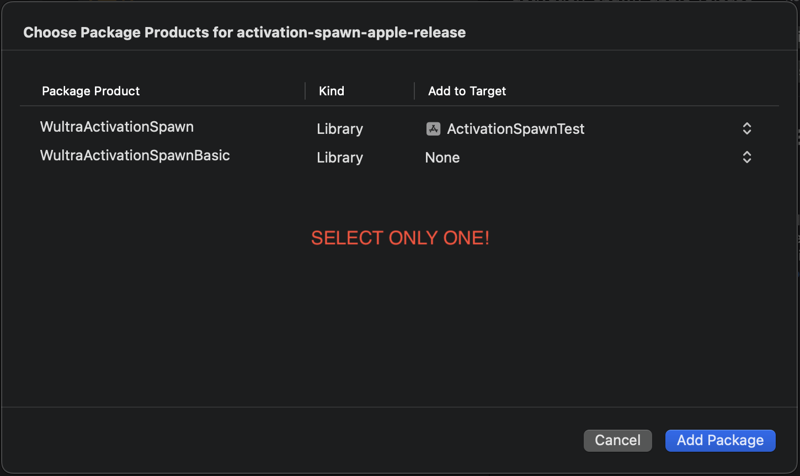

# Installation

## Dependencies

1. [Wultra Device Fingerprint for Apple](https://github.com/wultra/device-fingerprint-apple-release)
2. [PowerAuth SDK for Mobile Apps](https://github.com/wultra/powerauth-mobile-sdk) _(optional)_
3. [PowerAuth Networking for Apple platforms](https://github.com/wultra/networking-apple) _(optional)_

<!-- begin box info -->
To understand why is PowerAuth optional if you need it, follow the ["Do I Need PowerAuth"](Do-I-Need-PowerAuth.md) section of this documentation.
<!-- end -->

## Supported operating systems

The library is supported by the following operating systems:

- **iOS** 12.0+

## Swift Package Manager

The library is distributed as a package for Swift Package Manager:
   
1. Create (or append to if it already exists) `~/.netrc` file in your home directory with the following credentials you were provided alongside this document: 

   ```
   machine wultra.jfrog.io
         login [name@yourcompany.com]
         password [password]
   ```

2. Add the following repository as a dependency into your project:

   ```
   https://github.com/wultra/activation-spawn-apple-release.git
   ```

3. Based on your needs, __select one__ of the available products:
 - __WultraActivationSpawn__ that provides PowerAuth extensions
 - __WultraActivationSpawnBasic__ without PowerAuth extension

 

## Cocoapods 

The library is also distributed through a public git repository, which contains a podspec and scripts to download the framework from a private artifactory. If you're not using cocoapods in your project, visit [usage guide](https://guides.cocoapods.org/using/using-cocoapods.html).

1. Create (or append to if it already exists) `~/.netrc` file in your home directory with the following credentials you were provided alongside this document:

   ```
   machine wultra.jfrog.io
         login [name@yourcompany.com]
         password [password]
   ``` 

2. Add pod to your `Podfile`:

   ```rb
   target 'MyProject' do
       use_frameworks!
       pod 'WultraActivationSpawn', :git => 'https://github.com/wultra/activation-spawn-apple-release.git', :tag => '2.2.0'
       # If you don't need PowerAuth, use only the basic mutation of the framework.
       # pod 'WultraActivationSpawn/Basic', :git => 'https://github.com/wultra/activation-spawn-apple-release.git', :tag => '2.2.0'
   end
   ```
   You can check the latest versions of the libraries above on the release pages:
   - [WultraActivationSpawn releases page](https://github.com/wultra/device-fingerprint-apple-release/releases)

3. Run `pod install` in your project dictionary to make the `WultraActivationSpawn` framework available in your project.

## Read next

- [Usage (with PowerAuth)](Usage.md)
- [Usage (without PowerAuth)](Usage-Without-PowerAuth.md)
