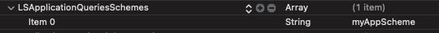
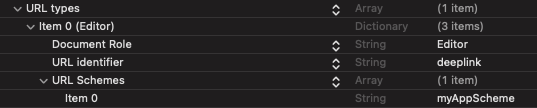

# Usage (Without PowerAuth)

<!-- begin remove -->
- [Naming conventions](#naming-conventions)
- [Integrating into the Source App](#integrating-into-the-source-app)
- [Integrating into the Target App](#integrating-into-the-target-app)
- [Passing additional data](#passing-additional-data)
- [Error handling and logging](#error-handling-and-logging)
<!-- end -->

Usage of this SDK is highly dependent on your use case. The following sections show common usage scenarios and principles.

## Naming conventions
 
|  | Explanation |
|---|---|
| __Transport Data__ | Data that will be transported from the _Source App_ to the _Target App_. |
| __Source App__ | Application that is starting the activation spawn process (will transfer the data). |
| __Target App__ | Application that will be installed (if not already) or retrieve data. |


## Integrating into the _Source App_

1. Define the _Target App_ in your code:

  ```swift
  import WultraActivationSpawn
  
  let app = WASApplication(
      // URL deeplink scheme (for example from myAppScheme://settings)
      deeplinkScheme: "myAppScheme",
      // from apps.apple.com/us/app/AppName/id123456789 
      appStoreIdentifier: 123456789
  )
  ```
  
2. Declare deeplink "permissions" for the URL scheme of _Target App_ in the `Info.plist` of the _Source App_.

 
 
3. Integrate into your `UIViewController`.

  - Sample implementation:

    ```swift
    import UIKit
    import WultraActivationSpawnBasic
    
    class SampleViewController: UIViewController {
        
        @IBOutlet weak var installButton: UIButton!
        @IBOutlet weak var transferButton: UIButton!
        
        // Additional data for generator (must be the same for both Source and Target App).
        let additionalData: Data = "myAdditionalData".data(using: .utf8)!
        // Additional data for transporter (must be the same for both Source and Target App).
        var sharedInfo: Data?
        
        // Transporter moves Activation Data to Target App.
        private var transporter: WASTransporter?
        
        private func prepareInstances() -> Bool {
            do {                
                // Note that the additionalData must be the same
                // for both Target and Source App. Please consult with Wultra
                // which configuration suits your needs.
                transporter = try WASTransporter(config: .semiStable(sameTeam: true, validityInSeconds: 10), additionalData: additionalData)
                
                return true
                
            } catch let e {
                // failed to create the transporter
                return false
            }
        }
        
        override func viewDidLoad() {
            super.viewDidLoad()
            
            // make sure all instances are ready
            guard prepareInstances() else {
                installButton.isHidden = true
                transferButton.isHidden = true
                // show error UI
                return
            }
            
            refreshButtons()
        }
        
        private func refreshButtons() {
            do {
                let installed = try app.isInstalled()
                installButton.isHidden = installed
                transferButton.isHidden = !installed
            } catch let error {
                // Failed to check if installed.
                // Deeplink scheme invalid or not declared in the Info.plist.
                // See the "error" variable for details.
            }
        }
        
        @IBAction func installClick(_ sender: UIButton?) {
            // Extension function from WultraActivationSpawn module.
            // Opens the AppStore sheet with given application for user to install.
            self.openAppStoreProductPage(application: app) {
                // refresh button status
                self.refreshButtons()
            }
        }
        
        @IBAction func transferClick(_ sender: UIButton?) {
        
            // create some data you want to transfer
            let data = "myDataToTransfer.data(using: .utf8)!
            
            // Send it to the Target App. This might prompt the user if he wants to open the application.
            // Use can use annotated for passing additional data.
            //  - "annotated" string is passed in the deeplink unencrypted (just base64 encoded) and can 
            //    be retrieved with `WASTransported.validate` method. In this example, we're sending name of the source app
            self.transporter?.transport(data: data, to: app, annotated: "mySourceApp", with: self.sharedInfo) { transportResult in
            // process the transport result
        }
    }
    ```

## Integrating into the _Target App_

1. Declare a URL scheme for the application to enable digesting the deeplink.

 
 
2. Retrieve the activation data from a deeplink.

 ```swift
 import UIKit
 import WultraActivationSpawnBasic
 
 @UIApplicationMain
 class AppDelegate: UIResponder, UIApplicationDelegate {
 
     // Additional data for processor (must be the same for both Source and Target App).
     let additionalData: Data = "myAdditionalData".data(using: .utf8)!
     // Shared data for processor (must be the same for both Source and Target App).
     var sharedInfo: Data?
 
     func application(_ app: UIApplication, open url: URL, options: [UIApplication.OpenURLOptionsKey: Any] = [:]) -> Bool {
            
         do {
             // Note that the additionalData must be the same
             // for both Target and Source App.
             let processor = WASProcessor(additionalData: additionalData)
             
             // First, validate the deeplink if it's valid activation-spawn deelink
             // and retreive annotation data (when available)
             let validationResult = transporter.validate(deeplink: url)
             
             switch validationResult {
             case .success(let data):
                 print(data.annotation) // prints "mySourceApp" as set in the example above (Source App integration)
             case .failure(let e):
                 // not a valid Activation Spawn deeplink
                 // do some error handling
                 return false
             }
                
             // extract data from deeplink
             let data = try transporter.process(deeplink: url, with: sharedInfo)
             // .. process the data
                
             return true // mark deeplink as accepted
         } catch let error {
             // process error
             return false
         }
     }
 }
 ```
 
## Passing custom data

For your convenience, you can pass custom data from the _Source App_ to the _Target App_.

### `annotation`

Annotation is a string in the deeplink and is accessible without the need to decrypt the data. 

This is good for example if you want to pass some data that will help you with decoding, like the id of the _Source App_ or other __public__ data. Always assume that the annotation data can be logged as plain-text in the system console.

Example usage of annotation:

```swift
// In the source app:
transporter.transport(data: data, to: app, annotated: "mySourceApp") { transportResult in
    // Process the transport result
}

// In the target app
let validationResult = transporter.validate(deeplink: url)
             
switch validationResult {
case .success(let data):
    print(data.annotation)
case .failure(let e):
    // not a valid Activation Spawn deeplink
    // do some error handling
}
```

 
## Error handling and logging

_If you have a problem with syncing your Source and Target App configuration, we recommend turning on debug logging by `WASLogger.verboseLevel = .debug`_

### Exceptions
 
All methods that can produce an error are throwing various exceptions (as described in the in-code documentation).

All exceptions implement `CustomStringConvertible` protocol where details about the exception and possible solutions are explained (in the `description` property). __We highly recommend logging these exceptions into your log system as they provide great debug value about what went wrong.__

### Logging

The library is intensively logging into the console via `WASLogger`.

Possible log levels:

- `.debug` - Debug logging that outputs more granular data, use this only during development
- `.info` - prints info logs + logs for warning level produced by the library (__default level__)
- `.warning` - prints warnings and errors
- `.error` - prints errors only
- `.off` - logging is turned off

You can set the log level by `WASLogger.verboseLevel = .off`

## Read next

- [Transporter configuration](./TransporterConfig.md)