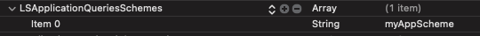

# Usage (With PowerAuth)

<!-- begin remove -->
- [Naming conventions](#naming-conventions)
- [Integrating into the Source App](#integrating-into-the-source-app)
- [Integrating into the Target App](#integrating-into-the-target-app)
- [Passing additional data](#passing-additional-data)
- [Error handling and logging](#error-handling-and-logging)
<!-- end -->

Usage of this SDK is highly dependent on your use case. The following sections show common usage scenarios and principles.

## Naming conventions
 
|  | Explanation |
|---|---|
| __Activation__ | PowerAuth activation inside the `PowerAuthSDK` instance in which the user enrolled. |
| __Activation Data__ | Data retrieved from the server by the _Source App_ that can activate _Target App_. |
| __Source App__ | Application that is starting the activation spawn process with a valid _Activation_. |
| __Target App__ | Application that will be installed (if not already) and activated. |


## Integrating into the _Source App_

> Prerequisite of an application that will activate the _Target App_ is properly configured and activated `PowerAuthSDK` instance.

1. Define the _Target App_ in your code:

  ```swift
  import WultraActivationSpawn
  
  let app = WASApplication(
      // URL deeplink scheme (for example from myAppScheme://settings)
      deeplinkScheme: "myAppScheme",
      // from apps.apple.com/us/app/AppName/id123456789 
      appStoreIdentifier: 123456789,
      // needs to be provided by the powerauth backend administrator at your company
      backendIdentifier: "AA1122XYZ" 
  )
  ```
  
2. Declare deeplink "permissions" for the URL scheme of _Target App_ in the `Info.plist` of the _Source App_.

 
 
3. Integrate into your `UIViewController`.

  - Sample implementation:

    ```swift
    import UIKit
    import WultraActivationSpawn
    import PowerAuth2
    
    class SampleViewController: UIViewController {
        
        @IBOutlet weak var installButton: UIButton!
        @IBOutlet weak var activateButton: UIButton!
        
        // Configured and activated PowerAuth instance.
        // Inject on segue for example.
        var pa: PowerAuthSDK!
        
        // Additional data for generator (must be the same for both Source and Target App).
        let additionalData: Data = "myAdditionalData".data(using: .utf8)!
        // Additional data for transporter (must be the same for both Source and Target App).
        var sharedInfo: Data?
        
        // Activator retrieves Activation Data from the server.
        private var activator: WASActivator?
        // Transporter moves Activation Data to Target App.
        private var transporter: WASTransporter?
        
        private func prepareInstances() -> Bool {
            do {
                // prepare the configuration
                let config = WASActivatorConfig(
                    sslValidation: .default,
                    baseURL: "https://your-domain.com/your-app"
                )
                activator = try WASActivator(powerAuth: pa, config: config)
                
                // Note that the additionalData must be the same
                // for both Target and Source App. Please consult with Wultra
                // which configuration suits your needs.
                transporter = try WASTransporter(config: .semiStable(sameTeam: true, validityInSeconds: 10), additionalData: additionalData)
                
                return true
                
            } catch let e {
                // failed to create activator or transporter
                return false
            }
        }
        
        override func viewDidLoad() {
            super.viewDidLoad()
            
            // make sure all instances are ready
            guard prepareInstances() else {
                installButton.isHidden = true
                activateButton.isHidden = true
                // show error UI
                return
            }
            
            refreshButtons()
        }
        
        private func refreshButtons() {
            do {
                let installed = try app.isInstalled()
                installButton.isHidden = installed
                activateButton.isHidden = !installed
            } catch let error {
                // Failed to check if installed.
                // Deeplink scheme invalid or not declared in the Info.plist.
                // See the "error" variable for details.
            }
        }
        
        @IBAction func installClick(_ sender: UIButton?) {
            // Extension function from WultraActivationSpawn module.
            // Opens the AppStore sheet with given application for user to install.
            self.openAppStoreProductPage(application: app) {
                // refresh button status
                self.refreshButtons()
            }
        }
        
        @IBAction func activateClick(_ sender: UIButton?) {
            
            // You need to authenticate the user with 2-factor scheme.
            // Note that for this you need to prompt the user for PIN code/password
            // or use biometry with "auth.useBiometry = true".
            // For demo purposes, we assume that the user has pin 1234.
            let auth = PowerAuthAuthentication()
            auth.usePossession = true
            auth.usePassword = "1234" // for demo purposes
            
            
            activator?.retrieveActivationData(for: app, with: auth) { result in
                switch result {
                case .success(let data):
                    // Send it to the Target App. This might prompt the user if he wants to open the application.
                    // Use can use tagged and annotated for passing additional data
                    //  - "tagged" string is encrypted alongside the data and is available after decryption in the 
                    //    Target App. In this example, we're sending userId
                    //  - "annotated" string is passed in the deeplink unencrypted (just base64 encoded) and can 
                    //    be retrieved with `WASTransported.validate` method. In this example, we're sending name of the source app
                    self.transporter?.transport(data: data, to: app, tagged: "user1", annotated: "mySourceApp", with: self.sharedInfo) { transportResult in
                        // process the transport result
                    }
                case .failure(let error):
                    // show error to the user
                    break
                }
            }
        }
    }
    ```

## Integrating into the _Target App_

1. Declare a URL scheme for the application to enable digesting the deeplink.

 
 
2. Retrieve the activation data from a deeplink.

 ```swift
 import UIKit
 import WultraActivationSpawn
 
 @UIApplicationMain
 class AppDelegate: UIResponder, UIApplicationDelegate {
 
     // Additional data for processor (must be the same for both Source and Target App).
     let additionalData: Data = "myAdditionalData".data(using: .utf8)!
     // Shared data for processor (must be the same for both Source and Target App).
     var sharedInfo: Data?
 
     func application(_ app: UIApplication, open url: URL, options: [UIApplication.OpenURLOptionsKey: Any] = [:]) -> Bool {
            
         do {
             // Note that the additionalData must be the same
             // for both Target and Source App.
             let processor = WASProcessor(additionalData: additionalData)
             
             // First, validate the deeplink if it's valid activation-spawn deelink
             // and retreive annotation data (when available)
             let validationResult = transporter.validate(deeplink: url)
             
             switch validationResult {
             case .success(let data):
                 print(data.annotation) // prints "mySourceApp" as set in the example above (Source App integration)
             case .failure(let e):
                 // not a valid Activation Spawn deeplink
                 // do some error handling
                 return false
             }
                
             // extract data from deeplink
             let data = try transporter.process(deeplink: url, with: sharedInfo)
             print(data.tag) // prints "user1" as set in the example above (Source App integration)
             // .. start the activation process
                
             return true // mark deeplink as accepted
         } catch let error {
             // process error
             return false
         }
     }
 }
 ```
 
3. Prepare the PowerAuth activation.

 ```swift
 import WultraActivationSpawn
 import PowerAuth2
 
 class MyActivationManager {
    
     // properly configured powerauth instance without a valid activation
     private var powerAuth: PowerAuthSDK!
 
     func prepareActivation(data: WASActivationData) {
         self.powerAuth.createActivation(data: data, name: "Simons' iphone") { result in 
             // continue with the activation
             // or process the error
         }
     }
 }
 
 ```
 
## Passing custom data

For your convenience, you can pass custom data from the _Source App_ to the _Target App_. There are 2 different types of custom string data that you can pass:

### `annotation`

Annotation is a string in the deeplink and is accessible without the need to decrypt the data. 

This is good for example if you want to pass some data that will help you with decoding, like the id of the _Source App_ or other __public__ data. Always assume that the annotation data can be logged as plain-text in the system console.

Example usage of annotation:

```swift
// In the source app:
transporter.transport(data: data, to: app, annotated: "mySourceApp") { transportResult in
    // Process the transport result
}

// In the target app
let validationResult = transporter.validate(deeplink: url)
             
switch validationResult {
case .success(let data):
    print(data.annotation)
case .failure(let e):
    // not a valid Activation Spawn deeplink
    // do some error handling
}
```

### `tag`

A tag is a string in the encrypted data and is accessible only after successful transport data decryption. 

This is good for example if you want to pass some data that will help you during the activation process in the _Target App_, like an ID of the user or other __sensitive__ data.

Example usage of tag:

```swift
// In the source app:
transporter.transport(data: data, to: app, tagged: "user1") { transportResult in
    // Process the transport result
}

// In the target app
let data = try transporter.process(deeplink: url)
print(data.tag) // prints "user1"
```

 
## Error handling and logging

_If you have a problem with syncing your Source and Target App configuration, we recommend turning on debug logging by `WASLogger.verboseLevel = .debug`_

### Exceptions
 
All methods that can produce an error are throwing various exceptions (as described in the in-code documentation).

All exceptions implement `CustomStringConvertible` protocol where details about the exception and possible solutions are explained (in the `description` property). __We highly recommend logging these exceptions into your log system as they provide great debug value about what went wrong.__

### Logging

You can set up logging for the library using the `WASLogger` class.

<!-- begin box info -->
Networking traffic is logged in its own logger described in the [networking library documentation](https://github.com/wultra/networking-apple).
<!-- end -->

#### Verbosity Level

You can limit the amount of logged information via the `verboseLevel` property.

| Level                  | Description                                       |
| ---------------------- | ------------------------------------------------- |
| `off`                  | Silences all messages.                            |
| `errors`               | Only errors will be logged.                       |
| `warnings` _(default)_ | Errors and warnings will be logged.               |
| `info`                 | Error, warning and info messages will be logged.  |
| `debug`                | All messages will be logged.                      |

#### Logger Delegate

In case you want to process logs on your own (for example log into a file or some cloud service), you can set `WASLogger.delegate`.

## Read next

- [Transporter configuration](./TransporterConfig.md)